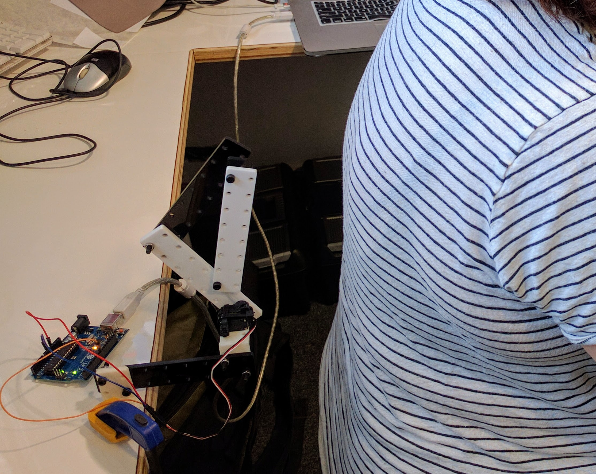

###Apparition Inducing Robot How to

Inspired by the work of [Sarah Sparkes](http://www.fact.co.uk/projects/no-such-thing-as-gravity/sarah-sparkes.aspx) at the exhibition, we propose the electronics experiment of a electrostatic charges detector

##Modes, 500ms delay
First image shows no delay, second image 500ms delay between the mouse movement and the robot

  
  

##Materials

  

* 1 x Arduino
* 1 x Servo Motor
* 1x Mechanical Arm
* PC/MAC/Linux with [Processing](processing.org)

##Activity
  Make a simple DIY apparition Inducing Robot
  
##References
* [Neuroscientists awaken ghosts](http://actu.epfl.ch/news/neuroscientists-awaken-ghosts-hidden-in-our-cortex/)
* [Robot Ghost](https://www.wired.com/2014/11/robot-ghost/)
* [Neurological and Robot-Controlled Induction of an Apparition](http://www.cell.com/current-biology/abstract/S0960-9822(14)01212-3)
