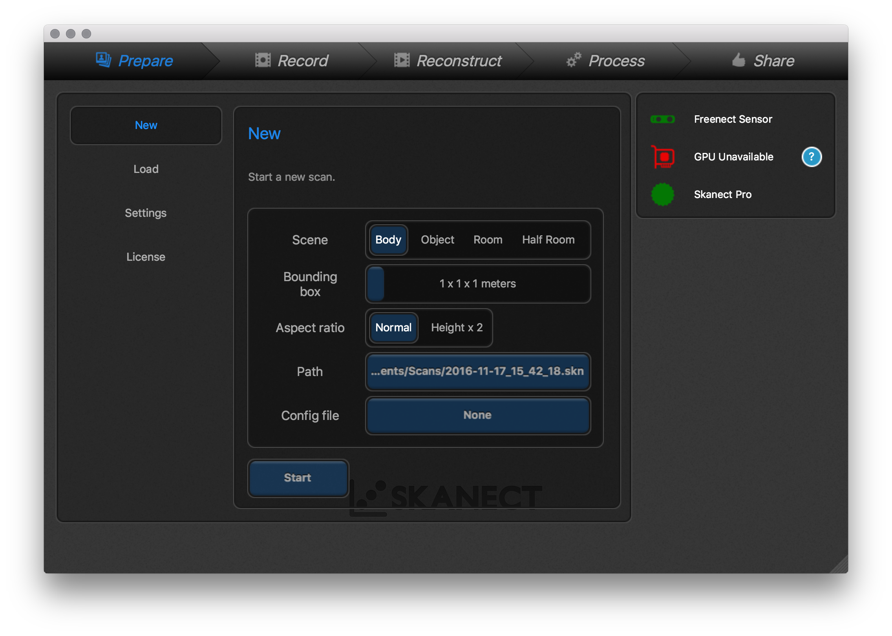
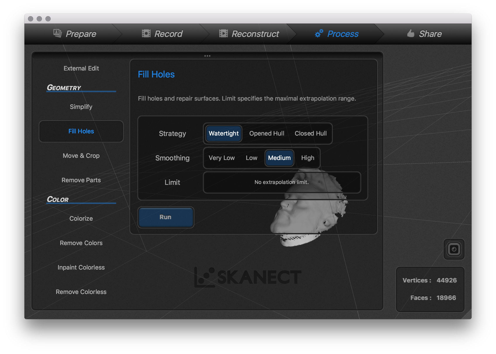
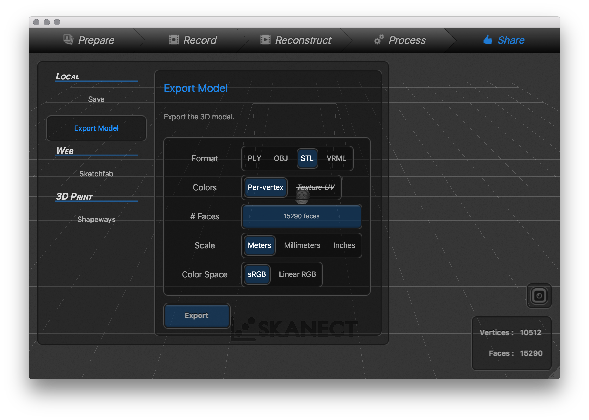

#Face Scanning Activity
  
Inspired by [Gina Czarnecki & John Hunt](http://www.fact.co.uk/projects/no-such-thing-as-gravity/gina-czarnecki-john-hunt.aspx) project.

###Materials
* Kinect for Xbox 360, Asus Xtion or Primesense Carmine  
* Skanect Software http://skanect.occipital.com/

##Scanning using **Skanect**
###Overview
  

###Visual Step by step

* Make sure the __Freenect Sensor__ icons is green

  
  

* When the image shows black it means that the sensor is close to the target

  

* The red color means that the sensor is in a good position

  
  
  
  
  
  
  
