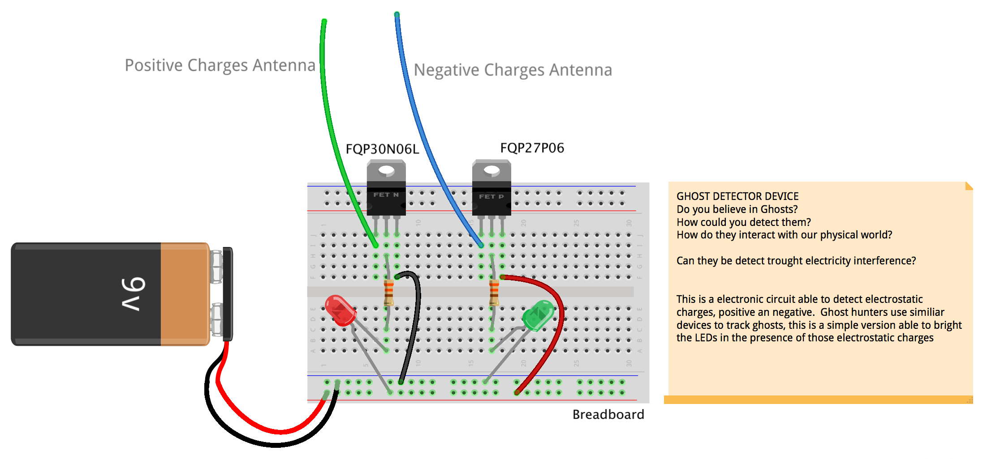

###Ghost Detector Device

Inspired by the work of [Sarah Sparkes](http://www.fact.co.uk/projects/no-such-thing-as-gravity/sarah-sparkes.aspx) at the exhibition, we propose the electronics experiment of a electrostatic charges detector

##Circuit 

  

* 9V Battery
* 9V battery connector
* 2 LEDs
* 2 Resistors 
* 1 P-FET FQP27P06
* 1 N-FET FQP30N06L
* 1 Breadboard
* Jumpers wires

##Activity

Ghosts hunters use electromagnetic field (EMF) as an indirect way to detect ghost interactions with our world, in this workshop you are going to make a simple electrostatic charger detector circuit that is able detect positive and negative static electricity and then go hunting for ghosts around the FACT bulding.

##References
* [Ghost Hunting](https://en.wikipedia.org/wiki/Ghost_hunting)
* ["The $1 Ghost Detector!" DIY V-Scope Tutorial Pt. 1](https://www.youtube.com/watch?v=ckFAs1i_41Q)
* ["How To Build Your Own Ghost Detector " V-Scope Pt. 2](https://www.youtube.com/watch?feature=player_embedded&v=rPw_jDi_Kyw)
* [RIDICULOUSLY SENSITIVE
ELECTRIC CHARGE DETECTOR](http://www.eskimo.com/~billb/emotor/chargdet.html)
