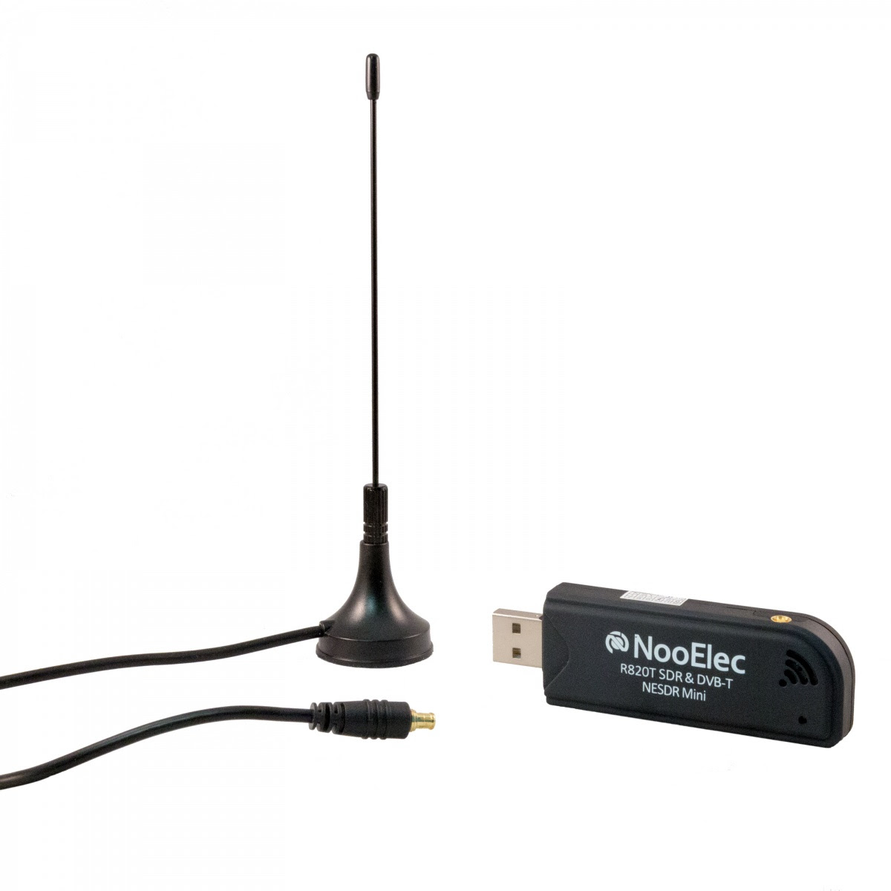

# Ghost EVP Electronic Voice Phenomena and Software-defined radio SDR 

In the workshop we will introduce you to a technology known as Software-defined radio, with a cheap USB device you enable a computer to listen to a widely range of radio frequencies.
We will be looking for EVPs using digital technologies. EVP[1] is an acronym for "Electronic Voice Phenomena" which is the recording of what sounds like human speech, words, phrases or other sounds into audio recording devices. These sounds, voices and words are usually not heard by the human ear while the recordings are being made but are only heard during playback or with the aid of computer amplifications, enhancements or modifications.

## Receiver

Both receiver costs about £20 on Amazon 

* [NooElec NESDR Mini 2 USB RTL-SDR](https://www.amazon.co.uk/dp/B00P2UOU72/ref=pe_385721_37986871_TE_item)
or
* [NooElec NESDR Nano 2 - Tiny Black RTL-SDR USB](https://www.amazon.co.uk/dp/B018PUYPCA/ref=pe_385721_37986871_TE_item)

## Sofware

* Gqrx SDR - [Linux / OSX](http://gqrx.dk/download) [/ Win](https://github.com/pothosware/PothosSDR/wiki/GQRX)

### References
* [Electronic Voice Phenomena](http://www.ghostlyvoices.net)
* [Electronic voice phenomenon] (https://en.wikipedia.org/wiki/Electronic_voice_phenomenon)
* [Software Defined Radio](https://en.wikipedia.org/wiki/Software-defined_radio)

### Radio Frequencies
* [Forum about Liverpool Radio Frequencies](http://www.wikiwirral.co.uk/forums/ubbthreads.php/topics/691194/radio_scanners.html)
